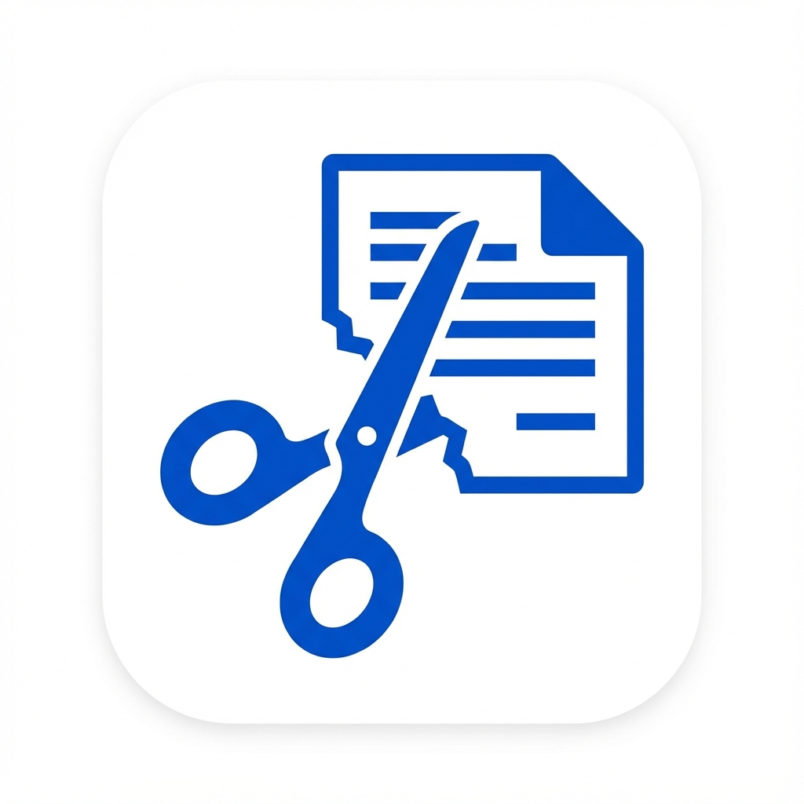

<div align="center">
  
  <h1>PaperSplit</h1>
</div>

**[English](#english) | [中文指南](#中文)**

<div id="english"></div>

## 📖 English

**PaperSplit** is a lightweight, privacy-focused web tool designed to split **A3 exam papers or documents into A4 format**. It runs entirely in your browser, ensuring your data remains private and secure.

### ✨ Key Features

*   **Smart Import**: Supports drag-and-drop for A3 PDFs or images (JPG/PNG).
*   **Visual Splitting**: Provides an intuitive red splitter line to manually adjust the cut position between pages.
*   **Seal Line Removal**:
    *   Dedicated "Remove Seal Line" mode.
    *   **Smart Detection**: Odd pages default to left, even pages default to right.
    *   Adjustable seal area that is automatically cropped during export.
*   **Batch Application**:
    *   **Apply to Same Type**: One-click apply settings to all Odd or all Even pages.
    *   **Apply to All**: Apply current configuration to every page.
*   **HD Export**: Generates high-quality A4 PDF documents using `jsPDF`.
*   **Responsive Design**: Works perfectly on both PC and mobile devices.

### 🚀 Quick Start

#### 1. Install Dependencies
This project uses `npm` for dependency management.
```bash
npm install
```

#### 2. Start Development Server
```bash
npm run dev
```
Open the local URL shown in the terminal (usually `http://localhost:5173`).

#### 3. How to Use
1.  **Import**: Click "Select File" or drag your file into the workspace.
2.  **Adjust**:
    *   Move the **Red Line** to set the A4 split position.
    *   Click "**Remove Seal Line**" to add a cut-off area if needed (draggable).
3.  **Batch**: Use "Same Type" or "All Pages" buttons to apply your settings to other pages.
4.  **Export**: Click "Export as PDF (A4)" to download your processed file.

---

<div id="中文"></div>

## 🇨🇳 中文指南

**PaperSplit** (原 PDF Edit) 是一个基于 Web 的轻量级工具，专为将 **A3 格式的试卷或文档拆分为 A4 格式**而设计。它完全在浏览器端运行，确保数据隐私安全。

### ✨ 核心功能

*   **智能导入**：支持拖拽上传 A3 PDF 文件或图片（JPG/PNG）。
*   **可视化分割**：提供直观的红色分割线，可手动调整左右页面的分割位置。
*   **密封线处理**：
    *   支持“去除密封线”模式。
    *   **智能识别**：奇数页默认在左侧，偶数页默认在右侧。
    *   可拖动调整密封线范围，导出时自动裁切该区域。
*   **批量应用**：
    *   **同类页**：一键应用当前配置到所有奇数页或所有偶数页。
    *   **所有页**：一键应用到文档所有页面。
*   **高清导出**：基于 `jsPDF` 生成高质量的 A4 PDF 文档。
*   **响应式设计**：完美适配 PC 和移动端操作，手机上也能轻松处理试卷。

### 🚀 快速开始

#### 1. 安装依赖
```bash
npm install
```

#### 2. 启动开发服务器
```bash
npm run dev
```
启动后，访问终端显示的本地地址（通常是 `http://localhost:5173`）。

#### 3. 使用流程
1.  **导入**：点击“选择文件”或直接拖拽文件到工作区。
2.  **调整**：
    *   移动红色**分割线**确定左右分页界限。
    *   若有密封线需要去除，点击“去除密封线”，调整灰色虚线区域。
3.  **批量**：调整好一页后，点击“同类页”或“所有页”将配置应用到其他页面。
4.  **导出**：点击底部的“导出为 PDF (A4)”，文件将自动下载。

---

## �️ Tech Stack / 技术栈

*   **Core**: Native JavaScript (ES6 Modules)
*   **PDF Processing**: `pdfjs-dist` (Rendering), `jspdf` (Generation)
*   **Styling**: CSS3 (Flexbox/Grid), Material Icons, Google Fonts
*   **Build**: Vite

## �📂 Project Structure / 项目结构

```
/
├── index.html          # Entry HTML
├── style.css           # Global Styles
├── vite.config.js      # Vite Configuration
├── src/                # Source Code
│   ├── main.js         # Entry Point
│   ├── state.js        # State Management
│   ├── dom.js          # DOM Elements
│   ├── file-handler.js # File Upload & Processing
│   ├── viewer.js       # Canvas Rendering
│   ├── editor.js       # Split/Seal Line Logic
│   └── exporter.js     # PDF Export Logic
└── DEPLOY.md           # Deployment Guide
```

## 📄 License


MIT License

## 📅 Changelog / 更新日志

### 2025-12-13 (Evening Update)
- **Bug Fix**: Fixed seal line drag jumping issue using delta-based calculation.
- **UX Improvement**: Auto-hide left thumbnail panel when no file is uploaded.
- **Config Adjustment**: Optimized default seal line position to 0.15/0.85 for better accuracy.

### 2025-12-13
- **Mobile Support**: Added touch event support for smooth split-line dragging on mobile devices.
- **UI Redesign**: Replaced split-line dots with an arrow handle (`↔`) for better visibility and usability.
- **Style Optimization**: Refactored `style.css` with cleaner structure and removed redundant code.
- **Branding**: Updated project icon and header logo.

